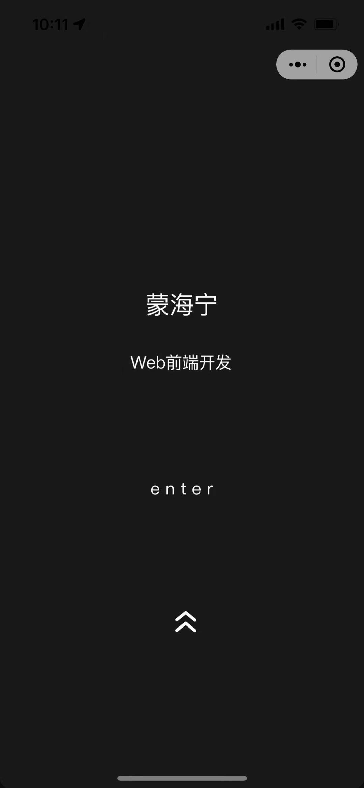
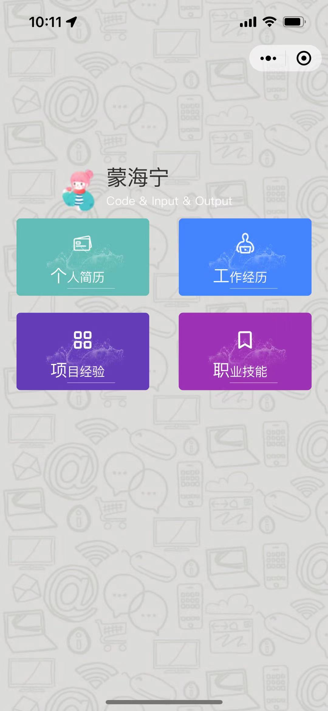
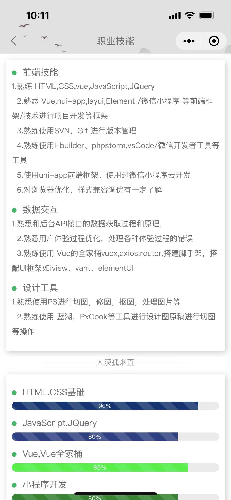
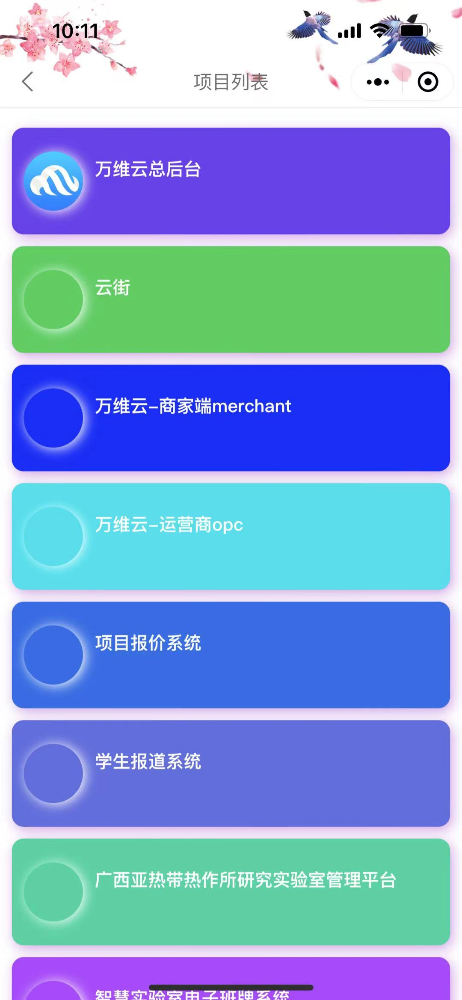

# 个人简历uni-app

#### 介绍
uni 开发的小程序，个人简历 微信小程序_个人简历，UI界面仿
#### 软件架构
uniApp+uview

#### 安装教程
1.  运行npm install moment --save
2.  HBuilder X运行

### 后台
3.  后台开源仓库地址[[https://gitee.com/he_qun/resume-miniprogram](https://github.com/asd964502906/Resume-of-admin)]

#### 特别说明
1.  再次开源请注明出处！！！ 再次开源请注明出处！！！ 
2.  我自己写了前后端分离，有用请给个starred
3.  UI设计参考了[https://gitee.com/he_qun/resume-miniprogram]

